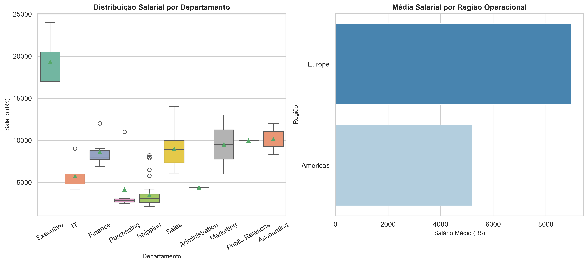

# sergio_leite_projeto_final

## Nome do projeto

Análise Exploratória de dados

## Nome do Aluno e turma

**Aluno:** Sérgio Leite  
**Turma:** QA VDBI 2026/1 1  
**Curso:** Visualização de Dados e Business Intelligence  

## Objetivo do trabalho

A Análise foi desenvolvida para tratar dados e visualizar salários e a distribuição geográfica dos trabalhadores.

## Explicação das Tabelas Usadas

O projeto utiliza duas bases de dados relacionais principais:

* **`df_salarios`**: Contém as informações financeiras dos colaboradores, incluindo a identificação única do funcionário (`ID_FUNCIONARIO`) e os valores correspondentes de remuneração (`SALARIO`).
* **`df_geografia`**: Contém a estrutura organizacional e localização dos colaboradores, composta pelas colunas `ID_FUNCIONARIO`, `PAIS`, `REGIAO` e `DEPARTAMENTO`.

## Resumo das duas Consultas SQL

1. **Consulta 1 (Filtragem e Limpeza):** Seleção dos registros ativos de funcionários com agrupamento inicial por departamento para validação de integridade dos dados salariais.
2. **Consulta 2 (Visão Geográfica):** Junção e agregação do volume de colaboradores e soma salarial por país e região de atuação para identificar os maiores centros de custo.

## Explicação da análise feita em Python

A análise exploratória foi realizada utilizando a biblioteca Pandas e dividida nos seguintes passos técnicos:

1. **Validação e Qualidade dos Dados:** Verificação de valores nulos, duplicados e tipos de dados nas tabelas `df_salarios` e `df_geografia`.
2. **Estatística Descritiva:** Cálculo das medidas de tendência central e dispersão (média, mediana, desvio padrão e amplitude) para a variável `SALARIO`.
3. **Análise de Frequência:** Mapeamento da quantidade de funcionários distribuídos por `REGIAO` e `DEPARTAMENTO` usando `value_counts()`.

## Principais resultados encontrados

### 1. Distribuição Salarial e Outliers

* A maioria dos colaboradores está concentrada na faixa salarial de entrada e intermediária, enquanto os outliers identificados no gráfico representam cargos executivos/especialistas com remuneração acima da média do grupo.

### 2. Volume de Colaboradores por Região

* A contagem de colaboradores indicou uma forte concentração do contingente americano, sendo dele o dobro do contingente europeu.

### 3. Análise de salários pós merge entre o df_salarios e df_geografia

* Distribuição Salarial por Departamento (Boxplot): Identificação de dispersão, mediana e presença de outliers salariais por setor.
* Média Salarial por Região (Gráfico de Barras): Comparativo do ticket médio salarial entre as regiões operacionais.
* A média salarial na Europa é quase 50% maior que da America
* Na distribuição de salários por departamento, é visivel o outlier demonstrado na imagem identificacao_outlier.png, onde os salários dos executivos é muito maior que a média dos outros setores. Estes setores que agora mostram muito melhor a média de cada um. 

## Como executar o projeto

1. **Clonar o repositório: https://github.com/seu-usuario/sergio_leite_projeto_final.git**
2. **Baixar e instalar o VSCode e Jupyter notebook**
3. **Instalar o ambiente virtual e instalar o python 3.11**
4. **Instalar importar as biblioecas pandas, seaborn, matplotlib e notebook**

# Tecnologias e Ferramentas

* **VSCode + Jupyter notebook** 
* **Python 3.11 no ambiente virtual (.venv)** 
* **Pandas**: Manipulação e limpeza de dados
* **Seaborn**: Visualização de dados estatísticos
* **Matplotlib**: Customização e exportação de gráficos
* **Git & GitHub**: Versionamento de código

## Sugestões de melhoria para futuras versões.
* Implementar testes de hipótese estatísticos para comparar médias salariais entre regiões.

## Imagens dos gráficos gerados

### Distribuição Salarial (Histograma / Boxplot)

### Análise Agrupada de Geografia

### Análise de salários pós merge entre o df_salarios e df_geografia

## Estrutura de Branches

O desenvolvimento do projeto foi modularizado em ramificações específicas para cada etapa:

* **`main`**: Versão estável e consolidada do projeto.
* **`feature/consultas-sql`**: Desenvolvimento e validação das consultas SQL (`Consulta 1` e `Consulta 2`).
* **`feature/analise-python`**: Execução da análise exploratória de dados (EDA) e geração dos gráficos.
* **`docs/readme-projeto`**: Estruturação e atualização da documentação técnica no `README.md`.

## Nota sobre o Fluxo de Versionamento

Na fase final do projeto — restando a execução do cruzamento das bases de dados, a consolidação das análises no `README.md` e a validação final das consultas SQL, percebeu-se a necessidade de alinhar a estrutura do repositório (criação de branches especificas) aos requisitos formais de versionamento do edital.

Para corrigir o histórico e padronizar a entrega, foi realizada uma **refatoração de fluxo no Git**:

1. **Mapeamento de Branches:** As etapas concluídas foram retroativamente isoladas em branches dedicadas (`feature/consultas-sql`, `feature/analise-python`, `docs/readme-projeto`).
2. **Adoção do Padrao Feature Branching:** A etapa pendente de cruzamento de dados e as alterações finais de documentação passam a ser versionadas estritamente em suas respectivas ramificações antes do `merge` com a branch `main`.

## Estrutura de diretórios

## 📁 Estrutura do Repositório

sergio_leite_projeto_final/
│
├── data/                               # Dados extraídos e visualizações exportadas
│   ├── query_01.csv
│   ├── query_02.csv
│   ├── analise_agrupada_geografia.png
│   ├── analise_avancada_salarios.png
│   └── identificacao_outlier.png
│
├── notebooks/                          # Análise exploratória e scripts Python
│   └── analise.ipynb
│
├── sql/                                # Consultas SQL originais
│   ├── query_01.sql
│   └── query_02.sql
│
├── .gitignore                          # Arquivos ignorados pelo Git (.venv, etc)
├── LICENSE                             # Licença do repositório
└── README.md                           # Documentação do projeto