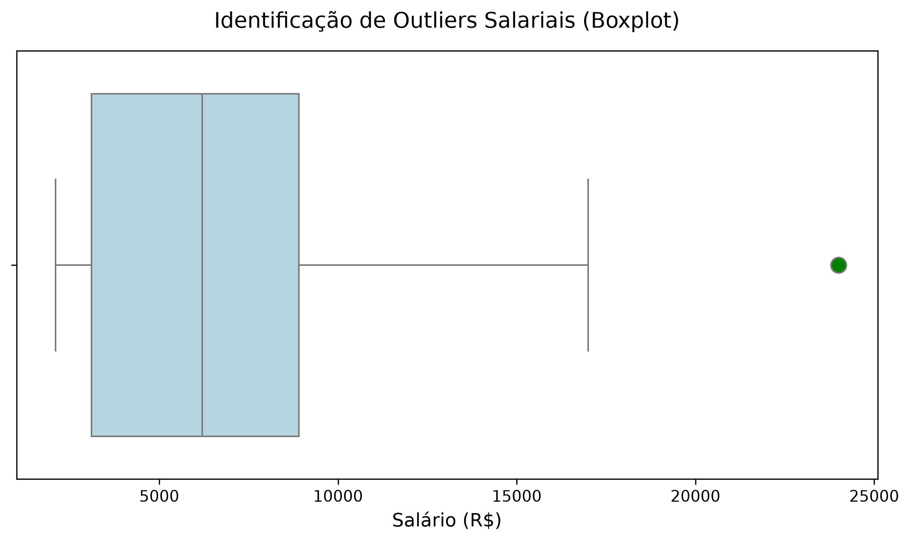
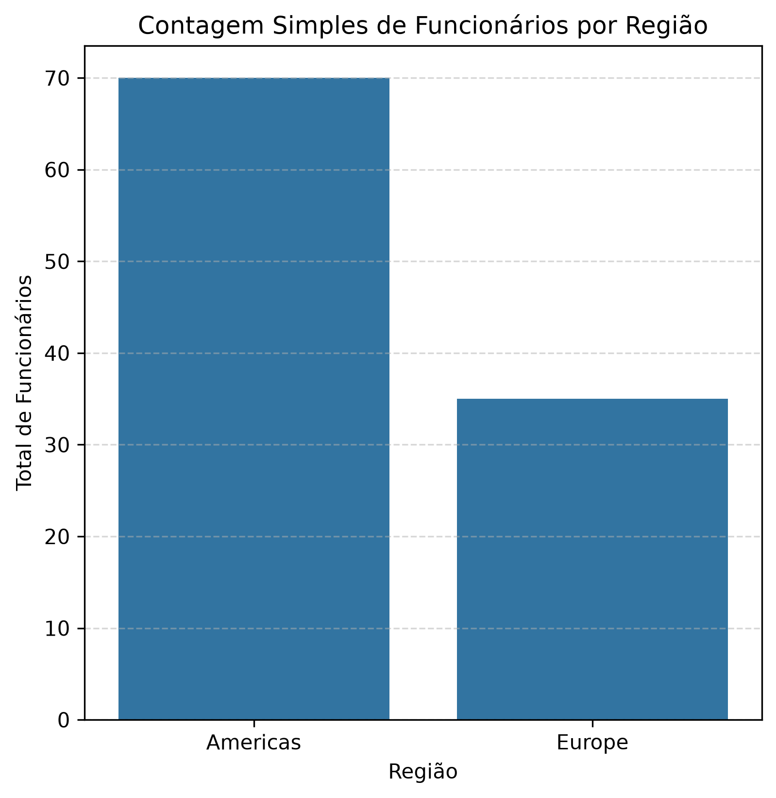

# sergio_leite_projeto_final

## Nome do projeto

Análise Exploratória de dados

## Nome do Aluno e turma

**Aluno:** Sérgio Leite  
**Turma:** QA VDBI 2026/1 1  
**Curso:** Visualização de Dados e Business Intelligence  

## Objetivo do trabalho

A Análise foi desenvolvida para tratar dados e visualizar salários e a distribuição geográfica dos trabalhadores.

## Explicação das Tabelas Usadas

O projeto utiliza duas bases de dados relacionais principais:

* **`df_salarios`**: Contém as informações financeiras dos colaboradores, incluindo a identificação única do funcionário (`ID_FUNCIONARIO`) e os valores correspondentes de remuneração (`SALARIO`).
* **`df_geografia`**: Contém a estrutura organizacional e localização dos colaboradores, composta pelas colunas `ID_FUNCIONARIO`, `PAIS`, `REGIAO` e `DEPARTAMENTO`.

## Resumo das duas Consultas SQL

1. **Consulta 1 (Filtragem e Limpeza):** Seleção dos registros ativos de funcionários com agrupamento inicial por departamento para validação de integridade dos dados salariais.
2. **Consulta 2 (Visão Geográfica):** Junção e agregação do volume de colaboradores e soma salarial por país e região de atuação para identificar os maiores centros de custo.

## Explicação da análise feita em Python

A análise exploratória foi realizada utilizando a biblioteca Pandas e dividida nos seguintes passos técnicos:

1. **Validação e Qualidade dos Dados:** Verificação de valores nulos, duplicados e tipos de dados nas tabelas `df_salarios` e `df_geografia`.
2. **Estatística Descritiva:** Cálculo das medidas de tendência central e dispersão (média, mediana, desvio padrão e amplitude) para a variável `SALARIO`.
3. **Análise de Frequência:** Mapeamento da quantidade de funcionários distribuídos por `REGIAO` e `DEPARTAMENTO` usando `value_counts()`.

## Principais resultados encontrados

* **Distribuição Salarial:** A média salarial foi calculada com presença de outliers mapeados no gráfico de distribuição.
* **Volume por Região:** A contagem de colaboradores indicou a concentração do contingente nas maiores regiões operacionais.

## Como executar o projeto

1. **Clonar o repositório: https://github.com/seu-usuario/sergio_leite_projeto_final.git**
2. **Baixar e instalar o VSCode e Jupyter notebook**
3. **Instalar o ambiente virtual e instalar o python 3.11**
4. **Instalar importar as biblioecas pandas, seaborn, matplotlib e notebook**

# Tecnologias e Ferramentas

* **VSCode + Jupyter notebook** 
* **Python 3.11 no ambiente virtual (.venv)** 
* **Pandas**: Manipulação e limpeza de dados
* **Seaborn**: Visualização de dados estatísticos
* **Matplotlib**: Customização e exportação de gráficos
* **Git & GitHub**: Versionamento de código

## Sugestões de melhoria para futuras versões.
* Implementar testes de hipótese estatísticos para comparar médias salariais entre regiões.

## Imagens dos gráficos gerados

### Distribuição Salarial (Histograma / Boxplot)

### Análise Agrupada de Geografia

